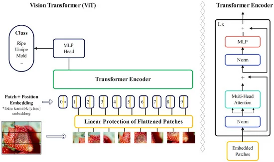
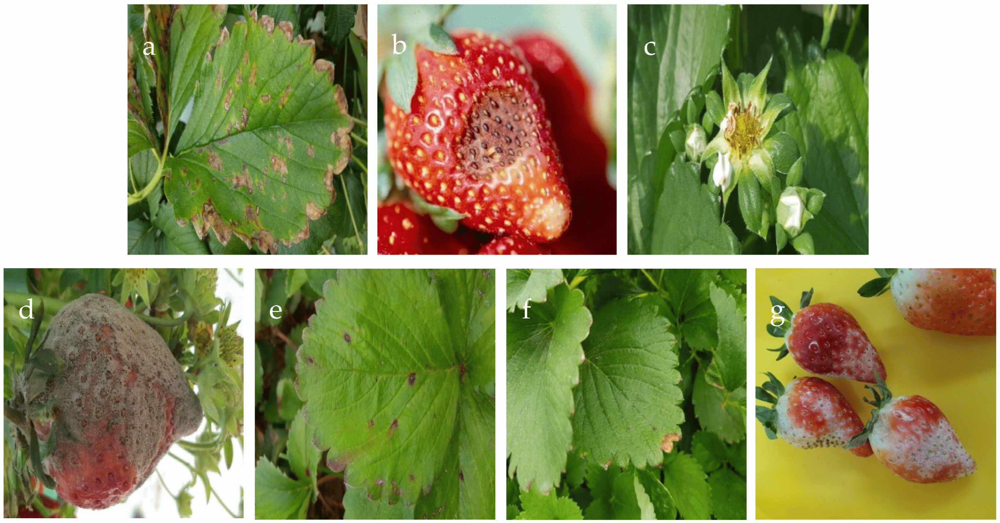

# vision-transformer-HuggingFace

## Download Dataset

To download the dataset needed for training:

- **Download Images**: [Link to images](https://osf.io/mtwfe)
- **Download Labels**: [Link to labels](https://osf.io/mtwfe)

After downloading:

1. Place the image files inside the `dataset/images/` folder.
2. Place the label files inside the `dataset/labels/` folder.

## What is Vision Transformer?
A standard transformer architecture was used to process token embeddings and 2D image data. Images were converted into sequences of flattened patches, which were then mapped to a fixed-size vector. Positional information was maintained using standard 1D position embeddings. The transformer encoder consists of alternating layers of self-attention and multi-layer perceptron (MLP) blocks, with layer normalization and residual connections. This setup allows the model to effectively represent and process both textual and image data. 

ViT differs from CNNs in its inductive bias, utilizing the two-dimensional neighborhood structure sparingly, primarily by dividing the image into patches. Adjustments to position embeddings were made during fine-tuning for images of different resolutions. Unlike CNNs, ViT’s position embeddings contain no initial information about patch positions, requiring the model to learn spatial relationships between patches from scratch. 

Instead of raw image patches, the input sequence can be made from feature maps of a CNN. In this hybrid model, patches from the CNN feature map underwent patch embedding projection. Patches with a spatial size of 1 × 1 flattened the feature map’s spatial dimensions, projecting it to the transformer dimension. Classification input and position embeddings were added as described. The encoder part of the original transformer architecture was employed by the ViT, and the decoder was not utilized. 

A sequence of embedded image patches, with a learnable class embedding prepended to the sequence, was taken as input to the encoder, augmented with positional information. The self-attention mechanism, a key component of the transformer architecture, was employed. Importance scores were assigned to patches by the model, allowing it to understand the relationship between different parts of an image and focus on the most relevant information. This aids in better comprehension of the image and enables the model to perform various computer vision tasks. Following this, a classification head attached to the output of the encoder received the value of the learnable class embedding to output a classification label.

The architecture of the vision transformer is shown below:

## The Study

This study was conducted on seven strawberry diseases shown below:

